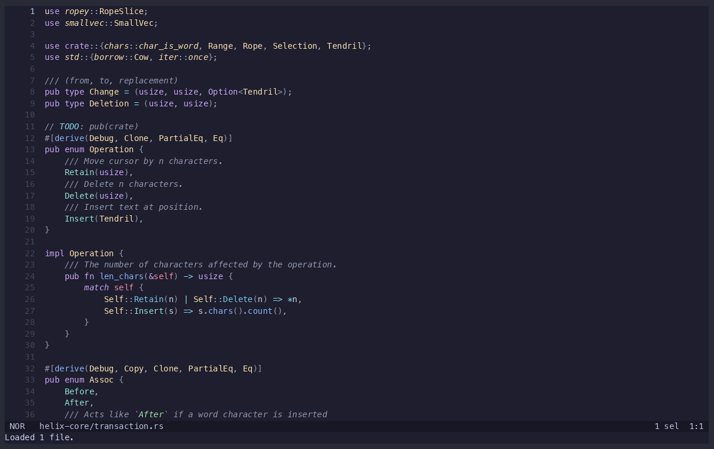

# scooter.hx

scooter.hx is Scooter's native [Helix](https://helix-editor.com/) plugin. It
embeds the same `scooter-core` engine as the
[Scooter TUI](https://github.com/thomasschafer/scooter), so searching,
selection, previews, and replacement follow the TUI's behaviour. The window
and all of its styling are rendered natively by Helix, using your Helix theme.



## Contents

<!-- TOC START -->
- [Requirements](#requirements)
- [Installation](#installation)
- [Usage](#usage)
- [Configuration](#configuration)
<!-- TOC END -->

## Requirements

scooter.hx requires Helix built from its
[`steel-event-system`](https://github.com/mattwparas/helix/tree/steel-event-system)
branch and the Steel toolchain installed from that checkout (including
`cargo xtask steel`). Follow that branch's
[Steel instructions](https://github.com/mattwparas/helix/blob/steel-event-system/STEEL.md).

The native dylib must use the exact `steel-core` and `steel-derive` revision
that Helix uses. This repository pins
[`dec633b908afeafeaf62bab457a92e2bf873745a`](https://github.com/mattwparas/steel/tree/dec633b908afeafeaf62bab457a92e2bf873745a);
changing the pin independently can make Helix reject the dylib at load time.

## Installation

Add the following after installing with either method below:

```scheme
(require "scooter/scooter.scm")
```

Put it in Helix's `init.scm` (normally under `~/.config/helix/`).

### Forge

```sh
forge pkg install --git https://github.com/thomasschafer/scooter.hx.git
```

### Build from source

```sh
git clone https://github.com/thomasschafer/scooter.hx.git
cd scooter.hx
cargo steel-lib
```

For a source checkout, require the checked-out Scheme file instead:

```scheme
(require "/absolute/path/to/scooter.hx/scooter.scm")
```

## Usage

- `:scooter` opens a new session or resumes the current one.
- `:scooter-new` cancels the current session and starts again with fresh
  fields and the current configuration.

Press `C-h` in the window for the full keymap.

`esc` hides the window when Scooter has nothing else to dismiss. The search
and any background work continue, and `:scooter` resumes that session. `C-c`
quits instead, cancelling work and discarding the session. After replacement
results, `esc` now hides the window too.

When the results list is focused, `e` opens the selected match in Helix and
hides the window; `A-o` opens it in the background and leaves the window open.
After a replacement completes, scooter.hx reloads every open, non-dirty Helix
buffer so its contents are current.

## Configuration

Configure scooter.hx in `init.scm`, after its `require` line. Settings are
captured when a session is created: they apply to the first `:scooter` with no
active session, or to `:scooter-new`; a hidden session retains its existing
settings until then.

### Options

<!-- CONFIG START -->
| Setting | Value | Default | Effect |
| --- | --- | --- | --- |
| `multiline` | boolean | `#f` | Allow search patterns to match across line boundaries. |
| `hidden` | boolean | `#f` | Include hidden files and directories. |
| `advanced-regex` | boolean | `#f` | Enable Scooter's advanced regular-expression engine. |
| `include-git-folders` | boolean | `#f` | Search Git metadata directories as well as normal files. |
| `escape-sequences` | boolean | `#f` | Interpret `\n`, `\t`, and `\\` in replacement text. |
| `wrap-text` | boolean | `#f` | Wrap long preview lines. |
| `syntax-highlighting` | boolean | `#t` | Highlight preview context with Helix runtime grammars and your Helix theme, rendered on the editor background (a deliberate difference from the TUI). |
| `window-size` | number, `0.5`–`1.0` | `0.9` | Set the window size as a terminal ratio. |
| `runtime-dir` | string path | Helix runtime discovery | Override the runtime used to load preview syntax grammars; otherwise discovery checks `HELIX_RUNTIME`, then Helix's config-directory runtime (`~/.config/helix/runtime`). |
<!-- CONFIG END -->

```scheme
(scooter-set! 'multiline #t)
(scooter-set! 'wrap-text #t)
(scooter-set! 'syntax-highlighting #f)
(scooter-set! 'window-size 0.85)
(scooter-set! 'runtime-dir "/path/to/helix/runtime")
```

### Keymap

`(scooter-keys! "path" bindings)` replaces one action's bindings. `bindings` may be one string or a list of strings, using the standard Helix syntax: modifiers are `S-`, `C-`, and `A-`. The path omits the leading `keys.`.

```scheme
(scooter-keys! "search.results.move_down" '("j" "down"))
```

Plugin-only bindings use the same function. `plugin.open_in_editor_bg` must not collide with a core binding reachable on the search screen; `plugin.hide` may overlap core bindings, which take precedence in their active context.

### Default keymap

Bindings are written in Helix's key syntax.

<!-- KEYS START -->
Defaults from scooter-core 0.4.0, matching the Scooter TUI, plus Scooter's plugin bindings.

| Binding path | Default key(s) | Description |
| --- | --- | --- |
| `general.quit` | `C-c` | Exit scooter |
| `general.reset` | `C-r` | Cancel in-progress operations, reset fields to default values and return to search screen |
| `general.show_help_menu` | `C-h` | Show the help menu containing keymaps |
| `plugin.hide` | `esc` | Hide Scooter when core has no action for the key in the current context; core bindings take precedence. |
| `plugin.open_in_editor_bg` | `A-o` | Open the selected result in Helix without hiding Scooter. |
| `results.quit` | `enter`, `q` | Exit scooter. This is in addition to the `quit` command in the `general` section. |
| `results.scroll_errors_down` | `j`, `down`, `C-n` | Navigate to the error below |
| `results.scroll_errors_up` | `k`, `up`, `C-p` | Navigate to the error above |
| `search.fields.focus_next_field` | `tab` | Focus on the next field |
| `search.fields.focus_previous_field` | `S-tab` | Focus on the previous field |
| `search.fields.trigger_search` | `enter` | Trigger a search |
| `search.fields.unlock_prepopulated_fields` | `A-u` | Allow editing of prepopulated search fields. |
| `search.results.back_to_fields` | `esc`, `C-o` | Move focus back to the search fields |
| `search.results.flip_multiselect_direction` | `A-;` | Flip the direction of the multiselect selection |
| `search.results.move_bottom` | `G` | Navigate to the last search result |
| `search.results.move_down` | `j`, `down`, `C-n` | Navigate to the search result below |
| `search.results.move_down_full_page` | `C-f`, `pagedown` | Navigate to the search result a page below |
| `search.results.move_down_half_page` | `C-d` | Navigate to the search result half a page below |
| `search.results.move_top` | `g` | Navigate to the first search result |
| `search.results.move_up` | `k`, `up`, `C-p` | Navigate to the search result above |
| `search.results.move_up_full_page` | `C-b`, `pageup` | Navigate to the search result a page above |
| `search.results.move_up_half_page` | `C-u` | Navigate to the search result half a page above |
| `search.results.open_in_editor` | `e` | Open the selected result in Helix and hide Scooter. |
| `search.results.toggle_all_selected` | `a` | Toggle whether all results will be replaced or ignored |
| `search.results.toggle_multiselect_mode` | `v` | Toggle whether multiselect mode is enabled |
| `search.results.toggle_selected_inclusion` | `space` | Toggle whether the currently highlighted result will be replaced or ignored |
| `search.results.trigger_replacement` | `enter` | Trigger a replacement |
| `search.toggle_hidden_files` | `C-t` | Toggle inclusion of hidden files and directories, such as those whose name starts with a dot (.) |
| `search.toggle_interpret_escape_sequences` | `A-e` | Toggle interpretation of escape sequences in replacement text (\n becomes newline, \t becomes tab, \\ becomes backslash) |
| `search.toggle_multiline` | `A-m` | Toggle multiline search mode, which allows patterns to match across line boundaries |
| `search.toggle_preview_wrapping` | `C-l` | Toggle wrapping of lines that don't fit within the width of the preview |
<!-- KEYS END -->
