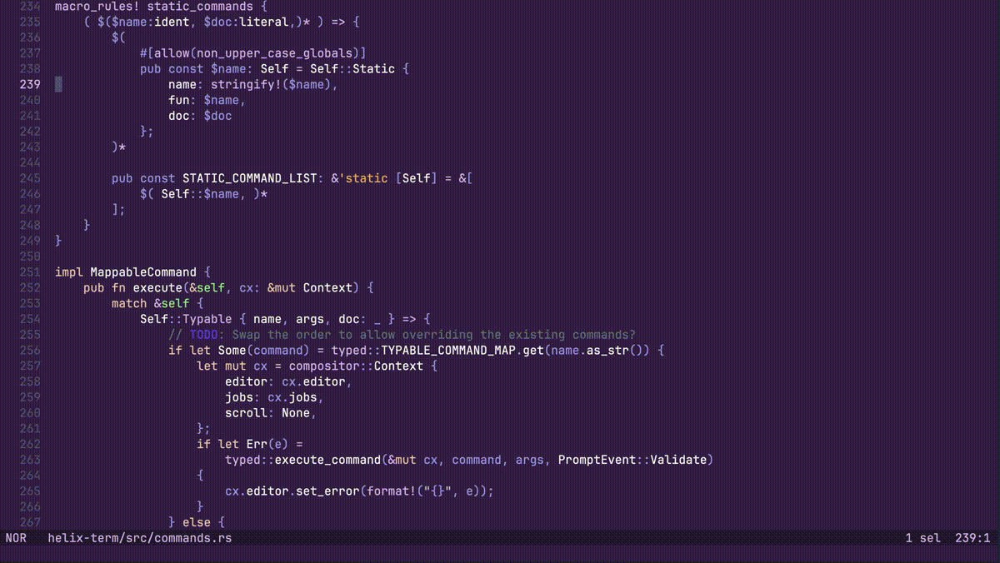

# scooter.hx

scooter.hx is a find-and-replace plugin for [Helix](https://github.com/helix-editor/helix/).

Search with either a fixed string or a regular expression, enter a replacement, and interactively toggle which instances you want to replace.

If the instance you're attempting to replace has changed since the search was performed, e.g. if you've switched branches and that line no longer exists, that particular replacement won't occur: you'll see all such cases at the end.



## Installation

Follow the instructions [here](https://github.com/mattwparas/helix/blob/steel-event-system/STEEL.md) to install Helix on the plugin branch.

Then, install the plugin with one of the installation methods below.

Once installed, you can add the following to `init.scm` in your Helix config directory:

```scheme
(require "scooter/scooter.scm")
```

You will then have the following commands available (which you can bind a keymap to in the usual way):
- `:scooter`, which either resumes an existing session if one exists, or otherwise starts a new session
- `:scooter-new`, which always starts a new session, cancelling any in-progress operations

### Using Forge

Forge is the Steel package manager, and will have been installed in the previous step. Run the following:

```sh
forge pkg install --git https://github.com/thomasschafer/scooter.hx.git
```

### Building from source

1. Clone and `cd` into this repo and run `cargo steel-lib`
1. Add `(require "<path>/scooter.hx/scooter.scm")` to `init.scm` in your Helix config (where `<path>` is the absolute path of the folder containing the scooter.hx repo)
